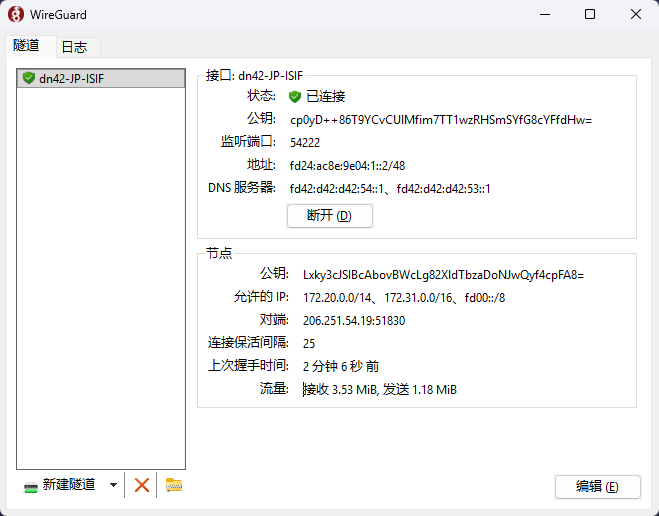
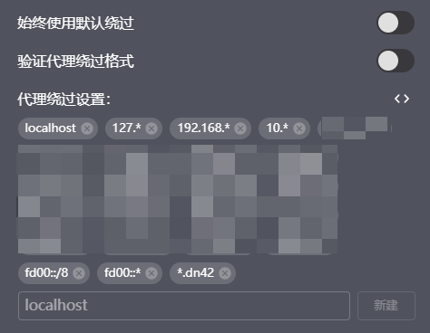

<!-- markdownlint-disable MD029 -->

## 前言

一直以来我都想实现这件事。DN42 作为一个叠加网络，不只是实验性的学习网络，实际上很多 BGP Player 还提供了各种有意思的服务。一些服务甚至是专门为 DN42 设计的，无法在公网访问。想要访问这些 .dn42 域名的服务，就必须将我的 Windows 电脑也接入 DN42 网络。

接入方案上，我暂时选择了使用 Wireguard 隧道来连接，并使用我已接入 DN42 的 VPS 作为中转，将包不经修改地转发到 DN42 网络中。

事实上由于跨境，更好的方案可能是使用 Xray 之类的工具，但是由于本人对 Xray 不太熟悉，暂且搁置。

## 思路

- 首先搭建隧道的两个端的配置并把隧道开起来，在隧道中给本端和对端都额外分配一个 DN42 内的 IP 地址（算上 v4 和 v6 的话各两个）
- 将这条到 Windows 的路由通过自己的内网广播到 DN42 外网中
- 在本端添加 DNS 服务器地址，指向对端 VPS 上的 DNS 服务器地址
- 添加本端防火墙放行规则
- 在本端安装 CA 证书，并将其添加到系统受信任的根证书颁发机构中，以便能够正确验证 .dn42 域名的 SSL 证书
- 关闭浏览器的安全 DNS 功能，否则浏览器无法解析 .dn42 域名
- 调整本端代理客户端中系统代理的 `代理绕过`，让系统在访问 .dn42 域名时，不会落到公网，而是走隧道访问对端 VPS 上的 DNS 服务器进行解析。

## 配置 Wireguard 隧道

首先你需要在 Windows 上安装 Wireguard 客户端。官方下载地址：[https://www.wireguard.com/install/](https://www.wireguard.com/install/)。

装完之后，不管是使用其自带的 GUI 还是命令行，都可以直接使用 WG 了。不过貌似默认命令行必须在管理员权限下才能使用 WG 相关的指令去访问接口等。

想要测试安装成功、接口信息的话，执行以下指令即可。

```bash
wg show
```

我这里还是通过 GUI 来配置的，可能我比较喜欢 GUI 操作吧。首先创建一个新的空白隧道，可以命名为 `dn42-<VPSname>-server` 之类的。

编辑这个隧道的配置时，可以看到自动创建了本端的公钥和私钥，后续配置 VPS 那一端的时候就会用到这个公钥了。

接下来配置一下本端的 WG 隧道接口信息，配置如下：

```ini
[Interface]
PrivateKey = 114514114514114514114514114514=
Address = fd24:ac8e:9e04:1::2/64
DNS = fd42:d42:d42:54::1, fd42:d42:d42:53::1

[Peer]
PublicKey = 1919810198101981019810198101981019810=
AllowedIPs = 172.20.0.0/14, 172.31.0.0/16, fd00::/8
Endpoint = 4.jp.sisy.cc:51830
PersistentKeepalive = 25
```

填写时需要注意几个点：

- `Address` 是本端的 WG 隧道接口地址，必须是一个 DN42 内的地址，并且必须和对端分配的地址在同一个子网内。另外，最好是和自己的 DN42 子网不在同一个子网内，以免产生路由混乱。
- `Address` 可以分配一个 IPv4 地址和一个 IPv6 地址，我这里暂时还是 v6 only，单纯是因为我比较懒。
- `DNS` 是分配给本机的 DNS 服务器地址，直接使用对端 VPS 上的 DNS 服务器地址即可。
- 由于我使用无线校园网，所以不会被分配到公网 IPv6 地址，因此我这里 `Endpoint` 使用的是对端的 v4 地址 `4.jp.sisy.cc`。

接下来在 VPS 上配置隧道的另一端 `wg-client.conf`，配置如下：

```ini
[Interface]
PrivateKey = hahahazhebushizhenzhengdesiyao=
ListenPort = 51830
Address = fd24:ac8e:9e04:1::1/64

PostUp = ip6tables -A FORWARD -i %i -j ACCEPT
PostUp = ip6tables -A FORWARD -o %i -j ACCEPT
PostDown = ip6tables -D FORWARD -i %i -j ACCEPT
PostDown = ip6tables -D FORWARD -o %i -j ACCEPT

Table = off

[Peer]
PublicKey = windowsshengchengdegongyao=
AllowedIPs = 172.20.0.0/14, 172.31.0.0/16, fd00::/8
```

可以看到，对端的 `Address` 是 `fd24:ac8e:9e04:1::1/64`，和本端的地址在同一个子网内。

添加 `PostUp` 和 `PostDown` 的规则是为了兜底，允许转发隧道中的流量，防止以后任何操作对 iptables 进行改动时使得该隧道出现问题。

配置好之后，分别在两端启动隧道，Windows 端直接点击连接，VPS 端：

```bash
wg-quick up wg-client
# 或者你喜欢的话
systemctl enable --now wg-quick@wg-client
```

如果一切顺利的话，执行 `wg show` 可以看到两端的隧道状态中的 `latest handshake` 都是从几秒到几分钟的较短时间，说明隧道已经成功建立并可以长期维持。



此时可以分别在两端尝试 ping 一下对端：

```bash
# 本机
ping fd24:ac8e:9e04:1::1
ping fd24:ac8e:9e04::3 # VPS 的 DN42 身份
# VPS 端
ping fd24:ac8e:9e04:1::2
```

到这一步为止，VPS 已经知道 Windows 端如何到达，但是并不知道如何去做路由转发。接下来需要将这个路由广播到 DN42 网络中，由于我使用 BIRD 并使用 Babel 协议搭建内网，这里以 Babel 配置为例，来演示如何添加一条静态路由并将其广播给内网的其他节点：

```ini
protocol direct {
        ipv4;
        ipv6;
        interface "dn42-dummy";
};

# 以下添加一条静态路由，指向 Windows 端的地址或稍大一些的地址段
protocol static wg_client {
        ipv6;
        route fd24:ac8e:9e04::1/64 via "wg-client";
}

protocol babel {
        ipv4 {
                import where source != RTS_BGP && is_self_net();
                export where (source = RTS_DEVICE) && is_self_net();
        };
        ipv6 {
                import where source != RTS_BGP && is_self_net_v6();
                # 添加对 RTS_STATIC 的判断，允许将静态路由广播到内网中
                export where (source = RTS_DEVICE || source = RTS_STATIC) && is_self_net_v6();
        };

        interface "innet-*" {
                type tunnel;
                rtt cost 96;
                rtt min 10 ms;
                rtt max 1000 ms;
                rtt decay 42;
        };
};
```

配置好之后刷新 BIRD 配置：

```bash
birdc c
```

## 防火墙

即使 Windows 可以出包，也不意味着回包能够穿过 Windows 的防火墙到达 WG 接口，因此我们需要在 Windows 端添加防火墙规则，允许来自 WG 接口的流量通过。可以通过以下步骤来添加规则：

1. `<Win>` + `R`，输入 `wf.msc` 打开 Windows Defender 防火墙高级安全设置。
2. 进入 `入站规则`，点击右侧的 `新建规则...`。
3. `规则类型` 选择 `自定义`。
4. `程序` 选择 `所有程序`。
5. `协议` 这一页直接选择 `任意`，即保持不变，进入下一页。
6. `作用域` 中的 `远程 IP 地址` 选择 `下列 IP 地址`
7. 将自己的两个 DN42 IP 地址段添加进去，比如我是 `fd24:ac8e:9e04::/48` 和 `172.23.15.32/27`，并点击 `确定`。
8. `操作` 选择 `允许连接`。
9. 命名为 `dn42-allow` 之类自己喜欢的规则名字，完成创建并保存。

## 代理绕过

如果你遇到以下情况，那说明你的流量被接管到代理端口了：

```plaintext
PS C:\Users\test> curl.exe http://burble.dn42/ -v
* Uses proxy env variable http_proxy == '127.0.0.1:7897'
*   Trying 127.0.0.1:7897...
* Established connection to 127.0.0.1 (127.0.0.1 port 7897) from 127.0.0.1 port 1973
* using HTTP/1.x
> GET http://burble.dn42/ HTTP/1.1
> Host: burble.dn42
> User-Agent: curl/8.19.0
> Accept: */*
> Proxy-Connection: Keep-Alive
>
* Request completely sent off
< HTTP/1.1 502 Bad Gateway
< Connection: keep-alive
< Keep-Alive: timeout=4
< Proxy-Connection: keep-alive
< Content-Length: 0
<
* Connection #0 to host 127.0.0.1:7897 left intact
```

由于 Windows 端的 DNS 服务器地址已经指向了对端 VPS 上的 DNS 服务器地址，因此我们需要调整一下代理客户端中系统代理的 `代理绕过`，让系统在访问 .dn42 域名时，不会落到公网，而是走隧道访问对端 VPS 上的 DNS 服务器进行解析。这里以 Clash Verge 为例。

打开设置，找到 `系统代理`，并点击设置按钮：


关闭 `始终使用默认绕过` 以及 `验证代理绕过格式`，并在绕过规则中添加 `*.dn42`、`fd00::*` 和 `fd00::/8`（虽然但是最后一个貌似不会生效，因为 Clash 不支持子网掩码格式的绕过规则）：



如果希望在开启 TUN 模式时访问 .dn42 域名，需要在配置 Clash 设置中的 `DNS 覆写`，在 `FakeIP 过滤` 中添加 `*.dn42`，否则 FakeIP 会劫持对 .dn42 域名的 DNS 查询。

## TLS 信任

由于 .dn42 域名的 SSL 证书是由 DN42 内部的 CA 颁发的，因此我们需要将这个 CA 证书添加到 Windows 系统中，以便能够正确验证 .dn42 域名的 SSL 证书。根证书可以在 [DN42 Wiki - Certificate-Authority](https://dn42.dev/services/ca/Certificate-Authority#manual-installation) 找到。我也把它放在这里：

```crt
-----BEGIN CERTIFICATE-----
MIID8DCCAtigAwIBAgIFIBYBAAAwDQYJKoZIhvcNAQELBQAwYjELMAkGA1UEBhMC
WEQxDTALBgNVBAoMBGRuNDIxIzAhBgNVBAsMGmRuNDIgQ2VydGlmaWNhdGUgQXV0
aG9yaXR5MR8wHQYDVQQDDBZkbjQyIFJvb3QgQXV0aG9yaXR5IENBMCAXDTE2MDEx
NjAwMTIwNFoYDzIwMzAxMjMxMjM1OTU5WjBiMQswCQYDVQQGEwJYRDENMAsGA1UE
CgwEZG40MjEjMCEGA1UECwwaZG40MiBDZXJ0aWZpY2F0ZSBBdXRob3JpdHkxHzAd
BgNVBAMMFmRuNDIgUm9vdCBBdXRob3JpdHkgQ0EwggEiMA0GCSqGSIb3DQEBAQUA
A4IBDwAwggEKAoIBAQDBGRDeAYYR8YIMsNTl/5rI46r0AAiCwM9/BXohl8G1i6PR
VO76BA931VyYS9mIGMEXEJLlJPrvYetdexHlvrqJ8mDJO4IFOnRUYCNmGtjNKHvx
6lUlmowEoP+dSFRMnbwtoN9xrmRHDed1BfTFAirSDL6jY1RiK60p62oIpF6o6/FS
FE7RXUEv0xm65II2etGj8oT2B7L2DDDb23bu6RQFx491tz/V1TVW0JJE3yYeAPqu
y3rJUGddafj5/SWnHdtAsUK8RVfhyRxCummAHuolmRKfbyOj0i5KzRXkfEn50cDw
GQwVUM6mUbuqFrKC7PRhRIwc3WVgBHewTZlnF/sJAgMBAAGjgaowgacwDgYDVR0P
AQH/BAQDAgEGMA8GA1UdEwEB/wQFMAMBAf8wHQYDVR0OBBYEFFR2iLLAtTDQ/E/J
bTv5jFURrBUVMB8GA1UdIwQYMBaAFFR2iLLAtTDQ/E/JbTv5jFURrBUVMEQGA1Ud
HgQ9MDugOTAHggUuZG40MjAKhwisFAAA//wAADAihyD9QgAAAAAAAAAAAAAAAAAA
//8AAAAAAAAAAAAAAAAAADANBgkqhkiG9w0BAQsFAAOCAQEAXKQ7QaCBaeJxmU11
S1ogDSrZ7Oq8jU+wbPMuQRqgdfPefjrgp7nbzfUW5GrL58wqj+5/FAqltflmSIHl
aB4MpqM8pyvjlc/jYxUNFglj2WYxO0IufBrlKI5ePZ4omUjpR4YR4gQpYCuWlZmu
P6v/P0WrfgdFTk0LGEA9OwKcTqkPpcI/SjB3rmZcs42yQWvimAF94GtScE09uKlI
9QLS2UBmtl5EJRFVrDEC12dyamq8dDRfddyaT4MoQOAq3D9BQ1pHByu3pz/QFaJC
1zAi8vbktPY7OMprTOc8pHDL3q8KFP8jJcoEzZ5Jw0vkCrULhLXvtFtjB0djzVxQ
C0IKqQ==
-----END CERTIFICATE-----
```

将其保存为 `dn42-ca.crt`，然后双击打开它，点击安装证书，选择 `为本地计算机安装`，选择 `将所有证书都放入下列存储`，并选择 `受信任的根证书颁发机构` 并安装即可。

安装完成后，便能够通过 curl 访问 .dn42 域名，但是由于浏览器的安全 DNS 功能会直接将 .dn42 域名解析到公网，因此还需要将它关闭。

此时访问任何 .dn42 域名应该都能够成功解析了。可以 curl 一下 `https://burble.dn42/`，或通过浏览器直接访问，如果能够成功访问并且证书验证通过的话，说明到这里就接入成功了。
